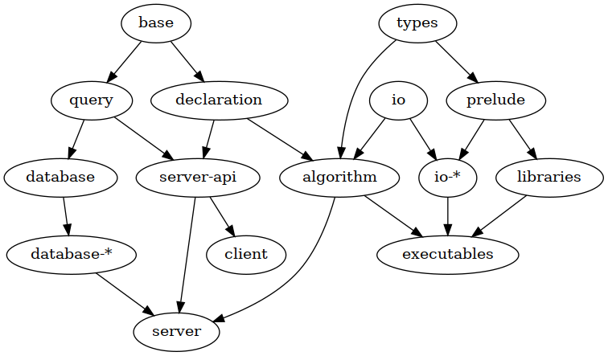

LineageFlow is a suite of libraries, executables and tools for the manipulation and exploration of spatio-temporal cell lineages and measurements over them.
It has been developed for the study of [reconstructed cell lineages](https://www.nature.com/articles/ncomms9674) extracted from 3D+time microscopy images of developing organisms.
Its main features are:

- a modular and composable ecosystem of [algorithms](algorithms);
- a [declarative interface](infrastructure/lineageflow-algorithm) for algorithms and the generation of executables;
- an uniform [graphical interface](tools/lineageflow-client) for all algorithms following the interface;
- integrated tools for the [visual](tools/lineageflow-viewer), [statistical](tools/lineageflow-plot) and [computational](tools/lineageflow-playground) exploration of measurements over temporal lineages.

More details on the ideas underlying this system can be found [here](https://pastel.archives-ouvertes.fr/tel-01689773).

- [Installation](#installation)
- [Usage](#usage)
- [Development](#development)
- [Architecture](#architecture)
- [Structure](#structure)
- [Algorithms](#algorithms)
- [Tools](#tools)
- [License](#license)
- [Acknowledgements](#acknowledgements)

# Installation

LineageFlow has been developed for Linux, and is written in Haskell.
In order to build it, `nix` must be installed in your computer.
This can be done with:

```
curl https://nixos.org/nix/install | sh
```

and by setting the following options in `/etc/nix/nix.conf`:

```
substituters = https://cache.nixos.org https://nixcache.reflex-frp.org
trusted-public-keys = cache.nixos.org-1:6NCHdD59X431o0gWypbMrAURkbJ16ZPMQFGspcDShjY= ryantrinkle.com-1:JJiAKaRv9mWgpVAz8dwewnZe0AzzEAzPkagE9SP5NWI=
```

which enables the appropriated binary caches for Nix, which greatly reduces the installation time of the system.
Afterwards, build the server, algorithms and client:

```
make server
make client
```

These can be deployed to a [virtual machine](virtual-machine) if desired.

# Usage

In first place, a location for the database must be chosen.
An empty folder suffices and it can be populated with tracking data using [`lf-import`](tools/lineageflow-import).

The server can be launched from the terminal with:

```
export LINEAGEFLOW_DATABASE=some-path
make run-server
```

which will start a session, and log the requests received by the client.

The graphical client can be launched from a separate terminal window with:

```
make run-client
```

which will open a chromium window containing the app and a short tutorial.

To enter a shell with all executables in the environment, simply type:

```
nix-shell
```

For the usage of algorithms from the command line, see the description of the [lineageflow-algorithm](infrastructure/lineageflow-algorithm) package.

# Developing

The code structure of all the [algorithms](algorithms) is the same, and can be used as a model for new ones.

In general lines, one implements algorithms in the `src` folder, and declares them in the `app` folder.
The file `app/Main.hs` declares the collection of algorithms that the executable contains.

During the development, one configures the system with:

```
nix-shell --command "cabal configure"
```

which works thanks to the `shell.nix` file included in all algorithm folders.
Afterwards, one may develop using `cabal repl` and `cabal build` as usual.

# Architecture

LineageFlow has been conceived as an ecosystem of roughly independent parts that interact through *declarative interfaces*.
Internally, this interface is defined by the Haskell [types](infrastructure/lineageflow-types) modelling the object of study and the data being manipulated.
Externally, this interface is defined by a model of the interaction of users with algorithms, centered on the description of algorithms as entities that:

- takes parameters as input;
- takes sets of named measurements as input;
- outputs a set of named measurements.

This [base](infrastructure/lineageflow-base) definition has two derivations:

- algorithm [declarations](infrastructure/lineageflow-declaration), that allow users to be informed on what are its parameters, inputs and outputs ;
- algorithm [queries](infrastructure/lineageflow-query), allows one to instantiate these parameters, inputs and outputs with actual data, making it possible to run the algorithm.

All interaction with algorithms happens through these interfaces, and for this reason, tools have been created to make the definition and use of these more practical and precise for both developers and users.
For developers, this is made by leveraging the type system of Haskell in order to [automatically generate](infrasctructure/lineageflow-algorithm) interfaces from type definitions.
For users, this is given by a graphical user interface based on a [server](tools/lineageflow-server)-[client](tools/lineageflow-client) communication model, which automatizes the interpretation of algorithm definitions and generates forms guaranteeing that only well-formed queries can be made.

Other design decisions include the possibility of multiple [databases](infrastructure/lineageflow-database) for storing measurements, and multiple [io methods](infrastructure/lineageflow-io) for reading measurements from files.

# Structure

The packages of the suite have the following dependency graph:



Each package has a well determined function:

- [`types`](infrastructure/lineageflow-types): types related to temporal cell lineages and measurements over it;
- [`prelude`](infrastructure/lineageflow-prelude): custom prelude for a safer manipulation of measurements;
- [`io`](infrastructure/lineageflow-io): interface for reading and writing measurements from files;
- [`io-*`](infrastructure/lineageflow-database-cbor): particular implementation of IO method;
- [`base`](infrastructure/lineageflow-base): types for the manipulation of algorithms;
- [`declaration`](infrastructure/lineageflow-declaration): types for the declaration of algorithms;
- [`algorithm`](infrastructure/lineageflow-algorithm): generation of executables from algorithm declarations;
- [`query`](infrastructure/lineageflow-query): types for querying measurements from a database;
- [`database`](infrastructure/lineageflow-database): interface for measurement database interactions;
- [`database-*`](infrastructure/lineageflow-database-sqlite): particular implementation of a measurement database;
- [`server-api`](tools/lineageflow-server-api): API for server-client interaction;
- [`server`](tools/lineageflow-server): server for querying databases, launching algorithms and running exploration tools;
- [`client`](tools/lineageflow-client): graphical interface for the server API.

# Algorithms

The following packages define algorithms both in library and executable form:

- [`tracking`](algorithms/lineageflow-tracking): generation of spatio-temporal lineages from cell trackings;
- [`statistics`](algorithms/lineageflow-statistics): global statistics for measurements;
- [`derivatives`](algorithms/lineageflow-derivatives): discrete derivatives for cell trajectories;
- [`homogenization`](algorithms/lineageflow-homogenization): homogenization of measurements on time, space, etc.;
- [`triangulations`](algorithms/lineageflow-triangulations): generation and manipulation of triangulations;
- [`trajectories`](algorithms/lineageflow-trajectories): trajectories, genealogical trajectories and path integrals;
- [`clustering`](algorithms/lineageflow-clustering): clustering of cell trajectories;
- [`deviations`](algorithms/lineageflow-deviations): statistics of deviations of neighboring cells;
- [`forces`](algorithms/lineageflow-forces): estimation of forces using least-squares methods;

# Tools

The following tools are also included in the suite:

- [`import`](tools/lineageflow-import): importing cell trackings from other file formats;
- [`export`](tools/lineageflow-export): exporting cell selections to other file formats;
- [`viewer`](tools/lineageflow-viewer): visualization of measurements in 3D+time;
- [`plot`](tools/lineageflow-plot): plot generation for standard statistics on measurements;
- [`playground`](tools/lineageflow-playground): utilities for interactive calculation on GHCi;
- [`script`](tools/lineageflow-script): scripts for the automation of multi-step algorithms;

with the following interface packages:

- [`viewer-interface`](tools/lineageflow-viewer-interface): interface for the `lf-viewer` executable;
- [`plot-interface`](tools/lineageflow-plot-interface): interface for the `lf-plot` executable;

# License

This project is licensed under the AGPL-3.

# Acknowledgements

This project has been developed by [Juan Raphael Diaz Simões](http://www.guaraqe.gq) during a PhD thesis, in collaboration between the [Condensed Matter Physics Laboratory](https://pmc.polytechnique.fr/) at [École Polytechnique](http://www.polytechnique.edu/) and [CNRS](http://www.dr4.cnrs.fr/), and the [BioEmergences Laboratory](http://bioemergences.eu/bioemergences/index.php) at [CNRS](http://www.dr4.cnrs.fr/).

The project has been directed by [Denis Grebenkov](https://pmc.polytechnique.fr/pagesperso/dg/), [Paul Bourgine](https://fr.linkedin.com/in/paul-bourgine-84a4383) and [Nadine Peyriéras](http://bioemergences.eu/bioemergences/people.php).
